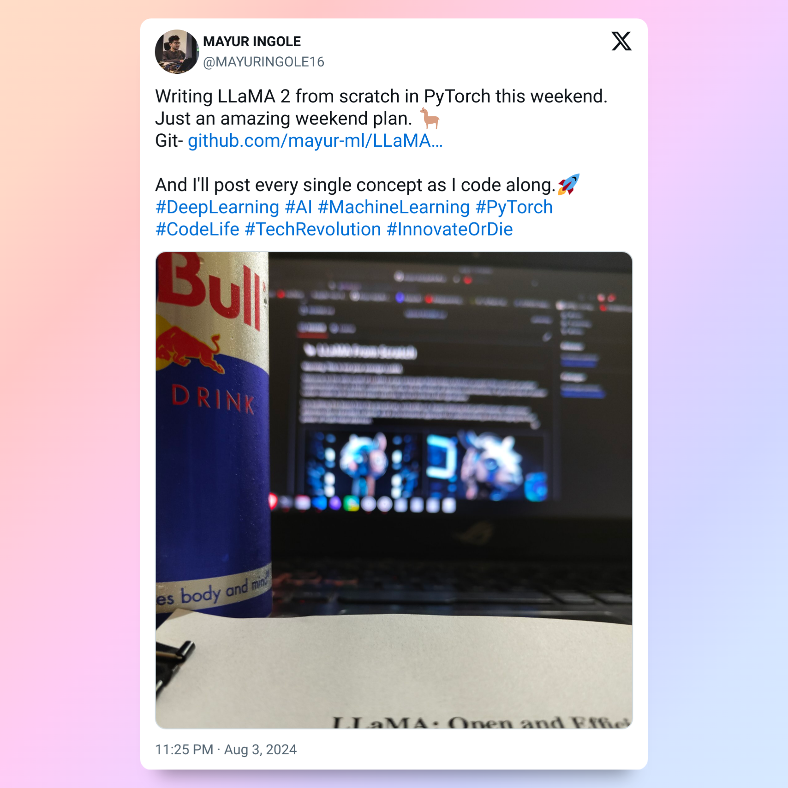

# 🦙 LLaMA From Scratch

**Warning: This is not your average LLaMA.**

Welcome to the wild world of LLaMA (Large Language Model Meta AI) from scratch! This isn't just another implementation; it's a bold, unapologetic dive into the heart of attention mechanisms. If you're tired of cookie-cutter models and watered-down tutorials, you've come to the right place.

I'm building this beast from the ground up, so buckle up. Expect blazing fast performance, meticulous attention (pun intended) to detail, and a no-nonsense approach to understanding and leveraging the full power of multi-head attention.

<!-- Images side by side -->
<table>
  <tr>
    <td></td>
    <td></td>
  </tr>
</table>

<!-- Tweet image -->

  

**Features:**
- Pure, unadulterated PyTorch goodness.
- Ruthless optimization for low latency and high throughput.
- Crystal clear code that's as savage as it is enlightening.

**Note:** This project has just begun. Follow along for frequent updates and ruthless progress as I tame this LLaMA from scratch!
